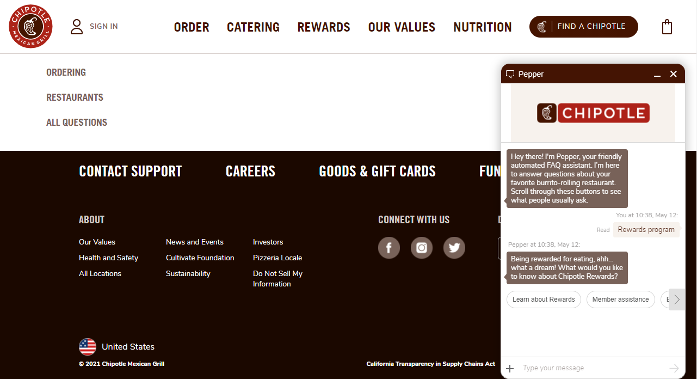
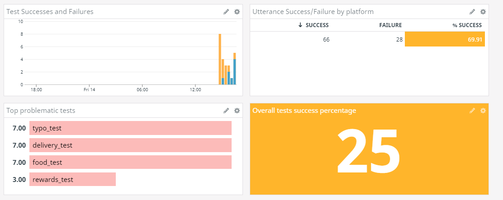

# Webchat Testing for Bespoken
This project demonstrates a set of tests setup to run against an Chatbot-embedded in a web browser.

We use the webchat-bot embedded with [Chipotle for this test](https://www.chipotle.com/contact-us):  


## How It Works
Our tests interact with the browser directly using Puppeteer to interact with the chatbot.

Here is an example test:
```
---
- test: Rewards test
- hi: Hey, nice to chat with you!
- rewards program: Being rewarded for eating, ahh... what a dream!
- learn about rewards: Dropping knowledge on the most delicious program there is!
- about points: I've got answers
- can i earn points anywhere: You can earn points anywhere in the US! Just make sure you
```

And here is how that looks running in the browser:

[](https://youtu.be/mgUPUwepYAw)

Magical, right?

To actually setup our tests, there are a few key pieces of information required:
| Field | Description | Required? |
|---|---|---|
| inputSelector | The CSS selector for the text input where messages should be entered | Yes |
| replySelector | The CSS selector for the reply HTML | Yes |
| widgetSelector | For chatbots that require clicking a button to open and begin the chat, the css selector for the button | No |

Once these fields are configured, you can write tests according to our standard test scripts, as described here:  
https://read.bespoken.io/end-to-end/guide/#overview

## Setup
* Clone the project `git clone https://github.com/bespoken-samples/webchat-sample`
* Run `npm install`

## Running The Tests
To run the tests manually:
* Go to the [e2e workflow page](https://github.com/bespoken-samples/webchat-samples/actions/workflows/test.yml)
* Click "Run Workflow"

That's all there is to it!

## Viewing The Results
The main output from the tests is an HTML report. It can be found as a part of each Github workflow that has been run:  
https://github.com/bespoken-samples/webchat-sample/actions/runs/706573143

The report summarizes the results of each test:

 
For each individual test, we can review each step that occurred:


Additionally, we have integrated with DataDog, where we can view our test results over time:  


## Learn More
Check out our blog post on the AWS Developer site to learn more about this project:
COMING SOON!
